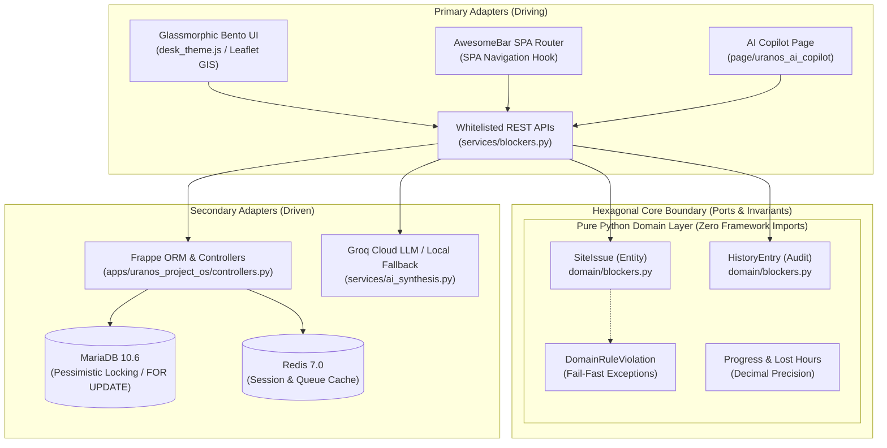
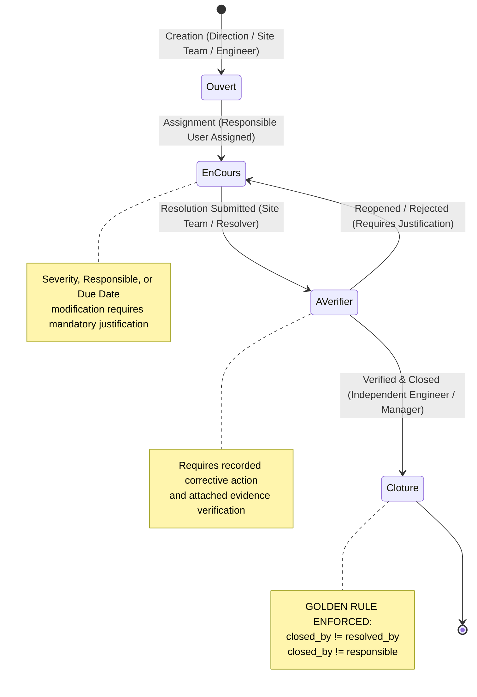
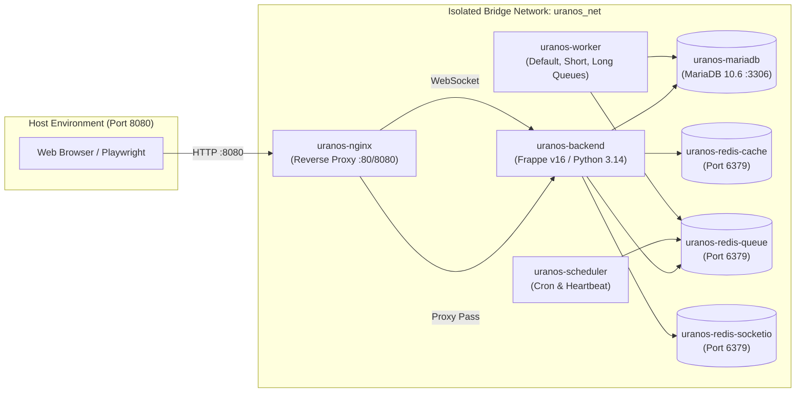

# ☀️ URANOS Project OS — Operating System for Solar Utilities

<div align="center">

[](https://python.org)
[](https://frappeframework.com)
[](https://erpnext.com)
[](https://docker.com)
[](https://mariadb.org)
[](https://redis.io)
[](https://playwright.dev)
[](https://pytest.org)
[](https://leafletjs.com)
[](https://groq.com)
[](https://en.wikipedia.org/wiki/Right-to-left)
[](#3-system-architecture--design)

<br/>

**Mission-critical supervisory and obstacle management platform for utility-scale solar photovoltaic (PV) power plants.**  
*Engineered for high-concurrency field operations, multi-site portfolio governance, zero-drift decimal progress tracking, and resilient bilingual field assistance.*

---

[Executive Summary](#1-executive-summary) • [System Architecture](#2-system-architecture--design) • [Business Workflow & Security](#3-business-workflow--the-golden-rule) • [Docker Infrastructure](#4-docker-infrastructure--deployment) • [Quick Start & Credentials](#5--quick-start--test-credentials) • [Quality Assurance](#6-quality-assurance--testing) • [Roadmap](#7-v11-engineering-roadmap)

---

</div>

## 1. Executive Summary

**URANOS Project OS** is an industrial-grade enterprise operating platform tailored specifically for the construction, quality control, obstacle resolution, and operational commissioning of utility-scale solar PV assets. Developed for the national renewable energy rollout in Tunisia, the platform centrally governs **20 solar power plants (1 MWp each)** spanning diverse bioclimatic zones from Bizerte and Zaghouan to Kairouan, Tozeur, and Tataouine.

```
       TUNISIA UTILITY-SCALE PV PORTFOLIO (20 MWp TOTAL)
┌───────────────────────────────────────────────────────────────┐
│  ☀️ 20 Photovoltaic Sites  •  ⚡ 1 MWp Installed Peak / Site    │
│  📍 Real-Time GIS Fleet   •  🛡️ Fail-Closed Pessimistic RBAC │
│  🤖 Dual-Engine Copilot   •  📊 Strict 4-State Blocker Cycle  │
└───────────────────────────────────────────────────────────────┘
```

### Key Pillars
- **Strict Role Isolation**: Segregated workspaces for Executive Management (`Direction`), Engineering Direction (`Ingénierie`), Site Supervision (`Chantier`), and System Administration (`Administrator`).
- **The Golden Rule Invariant**: Rigorous anti-fraud separation of duties barring resolvers from self-approving or closing their own obstacle resolutions (`closed_by != resolved_by`).
- **High-Precision Metric Integrity**: 100% elimination of binary floating-point roundoff errors via standard library [`Decimal`](file:///home/montassar/Desktop/llm/URANOS_EXAMEN_COMMUN_R01_Montassar_Zarai/URANOS_PROJECT_OS_CANDIDATE_20260917_R02/apps/uranos_project_os/uranos_project_os/domain/blockers.py#L11) arithmetic for installed physical progress, financial amounts, and lost hours.
- **Glassmorphic Bento Grid UI**: High-density desktop workspace and mobile-responsive viewport (390×844) featuring real-time inline Leaflet GIS cartography, dynamic AwesomeBar search routing, and full French/Arabic RTL layout inversion.
- **Dual-Engine AI Copilot**: Context-aware RAG issue synthesis with cited documentary evidence `[BLK-###]` paired with an offline, zero-network deterministic fallback algorithm.

---

## 2. System Architecture & Design

URANOS Project OS enforces **Hexagonal Architecture (Ports and Adapters)**. This guarantees that operational domain business rules are totally decoupled from the Frappe/ERPNext persistence framework, database drivers, and external network dependencies.



### A. Pure Domain Layer (`apps/uranos_project_os/uranos_project_os/domain/`)
- **Zero Framework Contamination**: **STRICT PROHIBITION** of `import frappe` or any submodules inside [`domain/`](file:///home/montassar/Desktop/llm/URANOS_EXAMEN_COMMUN_R01_Montassar_Zarai/URANOS_PROJECT_OS_CANDIDATE_20260917_R02/apps/uranos_project_os/uranos_project_os/domain/). The entire domain compiles and runs in standard CPython without database or web server dependencies.
- **Deterministic & Zero-IO**: Domain functions are pure, side-effect-free state transformers.
- **Decimal Precision**: No `float` types are permitted for physical progress, stock counts, or financial values. All arithmetic relies on [`Decimal`](file:///home/montassar/Desktop/llm/URANOS_EXAMEN_COMMUN_R01_Montassar_Zarai/URANOS_PROJECT_OS_CANDIDATE_20260917_R02/apps/uranos_project_os/uranos_project_os/domain/blockers.py#L11).
- **Core Entities**:
  - [`SiteIssue`](file:///home/montassar/Desktop/llm/URANOS_EXAMEN_COMMUN_R01_Montassar_Zarai/URANOS_PROJECT_OS_CANDIDATE_20260917_R02/apps/uranos_project_os/uranos_project_os/domain/blockers.py#L52): Manages status transitions, field updates, and invariant validations.
  - [`HistoryEntry`](file:///home/montassar/Desktop/llm/URANOS_EXAMEN_COMMUN_R01_Montassar_Zarai/URANOS_PROJECT_OS_CANDIDATE_20260917_R02/apps/uranos_project_os/uranos_project_os/domain/blockers.py#L34): Immutable audit record documenting previous value, new value, modifier, and justification.
  - [`DomainRuleViolation`](file:///home/montassar/Desktop/llm/URANOS_EXAMEN_COMMUN_R01_Montassar_Zarai/URANOS_PROJECT_OS_CANDIDATE_20260917_R02/apps/uranos_project_os/uranos_project_os/domain/blockers.py#L16): Domain exception thrown on any invariant breach.

### B. Services & Adapter Layer (`apps/uranos_project_os/uranos_project_os/services/`)
- **Authority on State Mutations**: Document state transitions MUST originate in the [`services/`](file:///home/montassar/Desktop/llm/URANOS_EXAMEN_COMMUN_R01_Montassar_Zarai/URANOS_PROJECT_OS_CANDIDATE_20260917_R02/apps/uranos_project_os/uranos_project_os/services/) layer.
- **Pessimistic Concurrency Locking**: Prevents distributed race conditions across concurrent requests by acquiring database row locks (`SELECT ... FOR UPDATE` via [`scoped_doc(..., lock=True)`](file:///home/montassar/Desktop/llm/URANOS_EXAMEN_COMMUN_R01_Montassar_Zarai/URANOS_PROJECT_OS_CANDIDATE_20260917_R02/apps/uranos_project_os/uranos_project_os/services/common.py)).
  > [!IMPORTANT]
  > **Deadlock Prevention Discipline**: The parent `Project` row is **always locked first** before acquiring the lock on the child `URANOS Blocker` record ([`_locked(name)`](file:///home/montassar/Desktop/llm/URANOS_EXAMEN_COMMUN_R01_Montassar_Zarai/URANOS_PROJECT_OS_CANDIDATE_20260917_R02/apps/uranos_project_os/uranos_project_os/services/blockers.py#L32)).
- **Authorized Transitions**: Document persistence is wrapped within [`with authorized_transition(): doc.save()`](file:///home/montassar/Desktop/llm/URANOS_EXAMEN_COMMUN_R01_Montassar_Zarai/URANOS_PROJECT_OS_CANDIDATE_20260917_R02/apps/uranos_project_os/uranos_project_os/services/blockers.py#L156). Direct Desk REST mutations attempting to bypass service logic are intercepted and blocked by [`controllers.py`](file:///home/montassar/Desktop/llm/URANOS_EXAMEN_COMMUN_R01_Montassar_Zarai/URANOS_PROJECT_OS_CANDIDATE_20260917_R02/apps/uranos_project_os/uranos_project_os/controllers.py).
- **Audit & Evidence Preservation**: Hard deletion of operational records is strictly prohibited ([`prevent_operational_delete`](file:///home/montassar/Desktop/llm/URANOS_EXAMEN_COMMUN_R01_Montassar_Zarai/URANOS_PROJECT_OS_CANDIDATE_20260917_R02/AGENTS.md)). Evidence attachments are strictly checked against `/private/files/`.

### C. Glassmorphic Bento UI & Real-Time Leaflet GIS
- **SaaS Bento Grid Layout**: Modern dashboard built with translucent acrylic glass panels (`backdrop-filter: blur(12px)`), adaptive high-contrast elevation borders, and real-time state badges.
- **Tunisia GIS Fleet Map**: Embedded interactive Leaflet cartography plotting the 20 photovoltaic solar plants with custom color-coded status pins, live GPS coordinates, capacity indicators, and quick-navigation links.
- **Bilingual French / Arabic & Native RTL**: Full bidirectional UI flipping (`[dir="rtl"]`) for Arabic locales with inverted table headers, RTL typography, and mirrored navigation controls.
- **AwesomeBar Global Search Routing**: Intercepts Frappe AwesomeBar events, dynamically resolving search result selections to instantaneous SPA route changes without ghost overlays or `[object Object]` DOM bugs.

### D. Dual-Engine AI Copilot (Cloud RAG + Offline Deterministic)
Located in [`services/ai_synthesis.py`](file:///home/montassar/Desktop/llm/URANOS_EXAMEN_COMMUN_R01_Montassar_Zarai/URANOS_PROJECT_OS_CANDIDATE_20260917_R02/apps/uranos_project_os/uranos_project_os/services/ai_synthesis.py), the copilot assists operational directors and engineers:
1. **Cloud RAG Engine**: Generates targeted executive syntheses via Groq Cloud LLM (Llama 3.3 / Qwen 2.5), citing precise blocker tags (e.g., `[BLK-00042]`), separating factual findings from recommended actions, and enforcing prompt injection immunity.
2. **Deterministic Offline Fallback**: In remote desert areas without cellular data or upon external API timeout/HTTP 5xx, the system seamlessly and silently activates [`build_deterministic_blocker_summary`](file:///home/montassar/Desktop/llm/URANOS_EXAMEN_COMMUN_R01_Montassar_Zarai/URANOS_PROJECT_OS_CANDIDATE_20260917_R02/apps/uranos_project_os/uranos_project_os/services/ai_synthesis.py#L67). It generates an analytical markdown synthesis directly from MariaDB records in Arabic, French, or English at zero cost and with zero hallucinations.

---

## 3. Business Workflow & The Golden Rule

Obstacles and site issues (blocages) adhere to a strict **4-state lifecycle state machine**.



### The Golden Rule: Anti-Fraud Separation of Duties
To eliminate compliance fraud and self-certification in physical utility deployments, URANOS enforces **The Golden Rule**:

$$\text{Verifier} \neq \text{Resolver} \quad \Longleftrightarrow \quad \texttt{closed\_by} \notin \{\texttt{resolved\_by},\, \texttt{responsible}\}$$

If an operative who resolved an obstacle attempts to verify or close it, the pure domain layer immediately aborts the transaction:
```python
# Pure domain rule enforced in domain/blockers.py
resolvers = {u.strip() for u in (self.resolved_by, self.responsible) if u and str(u).strip()}
if closed_by_user.strip() in resolvers:
    raise DomainRuleViolation("Auto-vérification refusée.")
```

### The 4-Tier Operational Blocker Lifecycle

| Step | State | Role | Permitted Actions | Invariants & Enforcements |
| :---: | :--- | :--- | :--- | :--- |
| **1** | **`Ouvert`** *(Open)* | Direction, Site Team, Engineer | Declare obstacle, specify category, initial severity, and affected work package. | Mandatory title, valid PV project assignment, auto-assigned naming series `BLK-.#####`. |
| **2** | **`En cours`** *(In Progress)* | Direction, Engineer | Assign responsible party, set due date, adjust severity. | Any modification to severity, deadline, or owner mandates an audit justification string in `URANOS Evidence`. |
| **3** | **`À vérifier`** *(Pending Verification)* | Site Team (Field Resolver) | Execute on-site fix, submit resolution details, upload private photo evidence. | Resolution cannot be blank; records `resolved_by` and timestamp `resolution_submitted_at`. |
| **4** | **`Clôturé`** *(Closed)* | Direction, Engineer (Independent) | Inspect physical proof, approve resolution, close issue permanently. | **Golden Rule**: Resolver cannot close. Rejection moves status back to `En cours` with mandatory `reason`. |

### Server-Enforced RBAC & Desk Dynamic Views
Access rights are strictly computed on the server side via [`security.py`](file:///home/montassar/Desktop/llm/URANOS_EXAMEN_COMMUN_R01_Montassar_Zarai/URANOS_PROJECT_OS_CANDIDATE_20260917_R02/apps/uranos_project_os/uranos_project_os/security.py) and reflected dynamically in the Bento workspace:

| Persona | Operational Profile | Allowed Projects | Desk Cards Rendered | Allowed Modules & Viewports |
| :--- | :--- | :---: | :---: | :--- |
| **`Administrator`** | System Administrator | All 20 Sites | **17 Cards** | Full global administration, security audit, DocType schemas, ERP settings. |
| **`direction_01`** | Portfolio Executive | All 20 Sites | **10 Cards** | Executive governance, portfolio GIS, financial cost items, delegations, high-level blockers. |
| **`ingenieur_01`** | Engineering Director | Assigned Sites | **11 Cards** | Work package milestones, technical NCRs, equipment maintenance, obstacle verification. |
| **`chantier_01`** | Site Operations Controller | Assigned Sites | **10 Cards** | Daily field progress declarations, on-site blocker reporting & resolution, warehouse stock. |

---

## 4. Docker Infrastructure & Deployment

The system is deployed as an orchestrated, self-contained multi-container stack configured via [`docker-compose.yml`](file:///home/montassar/Desktop/llm/URANOS_EXAMEN_COMMUN_R01_Montassar_Zarai/URANOS_PROJECT_OS_CANDIDATE_20260917_R02/docker-compose.yml) on the isolated bridge network `uranos_net`.



### Container Topology & Resource Orchestration

| Container Name | Base Image | Role & Responsibility | Exposed Ports | Healthcheck Contract |
| :--- | :--- | :--- | :---: | :--- |
| **`uranos-nginx`** | `nginx:alpine` | Reverse proxy, static asset cache, WebSocket proxying. | `8080:80` | HTTP GET `/` returns 200/301 |
| **`uranos-backend`** | Custom Frappe v16 | Gunicorn WSGI application server, Python 3.14 runtime, API adapter. | Internal | TCP ping on Gunicorn socket |
| **`uranos-mariadb`** | `mariadb:10.6` | Relational database (InnoDB, UTF8mb4, pessimistic row locks). | Internal | `mysqladmin ping` via root |
| **`uranos-redis-cache`** | `redis:7-alpine` | In-memory session, cache, and distributed lock broker. | Internal | `redis-cli ping` |
| **`uranos-redis-queue`** | `redis:7-alpine` | Background job message broker (RQ queues). | Internal | `redis-cli ping` |
| **`uranos-redis-socketio`**| `redis:7-alpine` | Real-time WebSocket pub/sub messaging. | Internal | `redis-cli ping` |
| **`uranos-scheduler`** | Custom Frappe v16 | Background scheduled cron tasks and periodic health monitors. | Internal | Managed process |
| **`uranos-worker-default`**| Custom Frappe v16 | Standard asynchronous background task processing. | Internal | Managed process |
| **`uranos-worker-short`**  | Custom Frappe v16 | High-priority rapid job processing queue. | Internal | Managed process |
| **`uranos-worker-long`**   | Custom Frappe v16 | Heavy analytical processing, simulations, and report exports. | Internal | Managed process |

---

## 5. 🚀 Quick Start & Test Credentials

This section provides a foolproof, step-by-step operational guide for the examination jury to spin up the complete Dockerized stack, configure the AI Copilot, and log in with the multi-persona test accounts.

### Prerequisites
- **Docker Engine** (v24.0 or higher) & **Docker Compose v2** (`docker compose`)
- Minimum 4 GB RAM and 10 GB disk storage available
- Modern Web Browser (Google Chrome, Chromium, Firefox, or Safari)

---

### Step 1: Environment Configuration (`.env`) & AI Copilot Setup

Before starting the containers, create your local `.env` configuration file from the provided template:

```bash
# 1. Navigate to the application root directory
cd URANOS_PROJECT_OS_CANDIDATE_20260917_R02

# 2. Copy the template to active .env
cp .env.example .env
```

Open `.env` in any text editor and review or customize the environment variables:

```env
# ── MariaDB Database Secrets ─────────────────────────────────────────────────
MYSQL_ROOT_PASSWORD=change_me_root_password
DB_FRAPPE_PASSWORD=change_me_frappe_password

# ── Frappe Site & SuperAdmin Master Credentials ──────────────────────────────
FRAPPE_SITE_NAME=uranos.localhost
ADMIN_PASSWORD=change_me_admin_password

# ── Redis Cache Sizing ───────────────────────────────────────────────────────
REDIS_CACHE_MAXMEM=256mb

# ── AI Copilot (Cloud RAG Engine — Optional) ─────────────────────────────────
# Get a free, ultra-fast API key at https://console.groq.com/keys
# Powers cloud RAG issue synthesis (Llama 3.3 70B & Qwen 2.5 72B).
GROQ_API_KEY=gsk_your_groq_api_key_here
```

> [!TIP]
> **Deterministic Offline Mode**: Adding a `GROQ_API_KEY` is completely **optional**. If omitted, invalid, or during an external network outage, the AI Copilot seamlessly and silently activates its pure deterministic fallback algorithm ([`build_deterministic_blocker_summary`](file:///home/montassar/Desktop/llm/URANOS_EXAMEN_COMMUN_R01_Montassar_Zarai/URANOS_PROJECT_OS_CANDIDATE_20260917_R02/apps/uranos_project_os/uranos_project_os/services/ai_synthesis.py#L67)). The system produces rich executive syntheses in Arabic, French, or English directly from local database records with zero cost and zero hallucinations!

To inject the key dynamically into an already running Frappe container without restarting:
```bash
docker compose exec backend bench --site uranos.localhost set-config -g groq_api_key "gsk_your_groq_api_key_here"
```

---

### Step 2: Spin Up the Stack via Docker

You can initialize and launch the entire stack using either the automated bootstrap script or standard Docker Compose commands:

#### Option A: Automated Bootstrap (Recommended for First-Time Setup)
```bash
# Grant execution permissions and run bootstrap
chmod +x setup_dev.sh
./setup_dev.sh
```
`setup_dev.sh` autonomously validates prerequisites, spins up all 10 containers, waits for MariaDB and Redis health checks, provisions the `uranos.localhost` Frappe site, installs `erpnext` and `uranos_project_os`, and synchronizes all 42 DocType schemas into MariaDB via `bench migrate`.

#### Option B: Standard Docker Compose Commands
```bash
# 1. Start all 10 services in detached mode
docker compose up -d

# 2. Inspect real-time container health
docker compose ps

# 3. View live backend logs if needed
docker compose logs -f backend

# 4. Graceful shutdown (preserving MariaDB & Redis volumes)
docker compose down
```

---

### Step 3: Official Examination Test Accounts (Credentials)

The platform is pre-loaded with four operational personas configured in MariaDB to test the strict Role-Based Access Control (RBAC), multi-project data isolation, and **The Golden Rule** (`closed_by != resolved_by`).

| Persona / Business Role | Email / Login Username | Password | Desk Cards Rendered | Project Access Scope | Operational Responsibilities & Permissions |
| :--- | :--- | :---: | :---: | :---: | :--- |
| 👔 **Direction / Manager**<br>*(Executive Portfolio Lead)* | `direction_01@uranos.local` | `Password123!` | **10 Cards** | **All 20 Sites**<br>*(National Fleet)* | • Strategic executive oversight & financial budgets.<br>• Global blocker declaration & independent closure.<br>• View portfolio-wide Leaflet GIS & KPIs.<br>*(Field installation entries hidden)*. |
| 👷‍♂️ **Ingénieur / Engineer**<br>*(Engineering Lead / Quality)* | `ingenieur_01@uranos.local` | `Password123!` | **11 Cards** | **Assigned Sites**<br>*(Restricted)* | • Technical design authority & work package review.<br>• Non-Conformance Reports (NCRs) & equipment maintenance.<br>• Responsible for blocker verification & independent closure.<br>*(Financial ledgers hidden)*. |
| 🦺 **Équipe Chantier / Site Team**<br>*(Site Controller / Field Team)* | `chantier_01@uranos.local` | `Password123!` | **10 Cards** | **Assigned Sites**<br>*(Restricted)* | • Daily field progress declarations & site warehouse stock.<br>• Obstacle declaration & corrective action submission (`À vérifier`).<br>• **Strictly barred from closing blockers** *(Golden Rule)*. |
| ⚡ **SuperAdmin**<br>*(System Administrator)* | `Administrator` | `change_me_admin_password`<br>*(or value in `.env`)* | **17 Cards** | **All 20 Sites**<br>*(Global Root)* | • Complete platform control & user access provisioning.<br>• Security Access Audit page, DocType schema editor.<br>• ERPNext core settings & queue monitoring. |

> [!IMPORTANT]
> **Live Verification of The Golden Rule**:
> 1. Log in as `chantier_01@uranos.local` and submit a resolution on an obstacle on their assigned site (e.g., `PV-0001`). The status moves to **`À vérifier`**.
> 2. Attempt to click **Verify & Close** with `chantier_01@uranos.local` $\to$ **The system immediately rejects the action** with an explicit error: `Auto-vérification refusée.`
> 3. Log in as `ingenieur_01@uranos.local` (or `direction_01@uranos.local`) $\to$ The independent engineer inspects the evidence and successfully transitions the obstacle to **`Clôturé`**.

---

### Step 4: Key Platform Portals & Direct URLs

Once the stack is initialized, open your browser and navigate to the desired views:

| Portal | Target URL | Authorized Roles | Description |
| :--- | :--- | :--- | :--- |
| **🌐 URANOS Main Desk** | [`http://localhost:8080`](http://localhost:8080) | All Personas | Glassmorphic Bento Grid workspace with dynamic role-filtered cards. |
| **📊 Blocker Executive Dashboard** | [`http://localhost:8080/desk/blocker-dashboard`](http://localhost:8080/desk/blocker-dashboard) | All Personas | Real-time Leaflet GIS fleet map, obstacle KPIs, and multi-criteria filters. |
| **📋 4-Column Blocker Kanban** | [`http://localhost:8080/desk/blocker-kanban`](http://localhost:8080/desk/blocker-kanban) | All Personas | Drag-and-drop lifecycle board with parametric reference date toolbar (`#uranos-kanban-ref-date`). |
| **🤖 Dual-Engine AI Copilot** | [`http://localhost:8080/desk/uranos-ai-copilot`](http://localhost:8080/desk/uranos-ai-copilot) | All Personas | Interactive RAG & deterministic synthesis with full French/Arabic RTL support. |
| **🛡️ Security & Access Audit** | [`http://localhost:8080/desk/access-audit`](http://localhost:8080/desk/access-audit) | `Administrator` | Visual matrix auditing granted sites, operational roles, and permission gates. |

---

## 6. Quality Assurance & Testing

URANOS Project OS implements a multi-tier testing strategy ensuring 100% adherence to domain invariants, concurrency safety, role isolation, and browser rendering fidelity.

```
┌────────────────────────────────────────────────────────────────────────┐
│                      QUALITY ASSURANCE PYRAMID                         │
│                                                                        │
│   🌐 72+ Playwright Chromium E2E Suites (Browser, RTL, Multi-Persona) │
│   ─────────────────────────────────────────────────────────────────    │
│   ⚡ 1 MW Synthetic Simulation Benchmark (58 Strict Assertions)        │
│   ─────────────────────────────────────────────────────────────────    │
│   🔬 250+ Pure Domain & Unit Tests (100% Zero-IO Invariant Coverage)  │
└────────────────────────────────────────────────────────────────────────┘
```

### A. Pure Domain & Unit Testing (Pytest)
Executes within standard CPython without requiring MariaDB, Redis, or a running web server:

```bash
# Set PYTHONPATH to application root and run test suite
PYTHONPATH=apps/uranos_project_os pytest tests/unit/ -v
```

- **Domain Isolation**: 250 test cases validating state transitions, decimal math, immutable history entries, and Golden Rule failure conditions.
- **Fail-Closed Guarantees**: Proves that unauthorized users or resolvers attempting self-closure receive immediate validation exceptions.

### B. End-to-End Browser Automation (Playwright)
Executes real user flows in headless or headed Chromium, across multiple viewports and languages:

```bash
# Install test runner dependencies
npm install --no-save playwright@1.62.1
npx playwright install chromium

# Run the complete field operations regression suite
node tests/browser/field_qa.mjs

# Execute multi-persona verification suite
node tests/browser/test_personas_all.mjs

# Execute bilingual Arabic RTL validation suite
node tests/browser/test_arabic_native_session.mjs

# Run support workflow assertions
node --test tests/unit/test_support_workflows_js.mjs
```

### C. 1 MW Photovoltaic Plant Simulation
A comprehensive mathematical and domain simulation modeling the complete construction, procurement, assembly, and commissioning of a 1 MWp solar power plant:

```bash
PYTHONPATH=apps/uranos_project_os python3 scripts/simulate_1mw.py --write-evidence
```
- **58 Invariant Assertions**: Validates that all baseline activity weights strictly sum to 100.0%, verifies cable reel and equipment allocations, tracks lost hours, and checks change order delegation caps.

---

## 7. V1.1 Engineering Roadmap

In alignment with Section 2 of [`PERIMETRE_ET_REGLES.md`](file:///home/montassar/Desktop/llm/URANOS_EXAMEN_COMMUN_R01_Montassar_Zarai/URANOS_PROJECT_OS_CANDIDATE_20260917_R02/PERIMETRE_ET_REGLES.md) (*"Principaux travaux restant après ce socle"*), the following capabilities are scheduled for the V1.1 release:

- [ ] **WebRTC Optical QR & Barcode Scanning**: Direct camera scanning (`html5-qrcode`) embedded in field forms for optical verification of cable drum barcodes and crate QR tags.
- [ ] **14-Day Predictive Lookahead Engine**: Schedule lookahead linking upcoming civil works with warehouse reserves to detect potential cable shortages proactively.
- [ ] **Native ERPNext General Ledger (`GL Entry`) Synchronization**: Automated ledger posting and purchase invoice triggers upon formal Stage Gate sign-off.
- [ ] **Full Offline PWA Service Worker (IndexedDB)**: Client-side cryptographic transaction queue with bidirectional conflict resolution for offline field operations.

---

## 8. Examination Compliance Matrix

| Requirement | Description | Compliance Status | Architectural Implementation & Code Reference |
| :--- | :--- | :---: | :--- |
| **REQ-1** | 1-Page Architecture Synthesis | **CONFORME** | Ports & Adapters detailed in [`README_CANDIDAT.md`](file:///home/montassar/Desktop/llm/URANOS_EXAMEN_COMMUN_R01_Montassar_Zarai/URANOS_PROJECT_OS_CANDIDATE_20260917_R02/README_CANDIDAT.md) and [`AGENTS.md`](file:///home/montassar/Desktop/llm/URANOS_EXAMEN_COMMUN_R01_Montassar_Zarai/URANOS_PROJECT_OS_CANDIDATE_20260917_R02/AGENTS.md). |
| **REQ-2** | Complete Blocker DocType | **CONFORME** | [`URANOS Blocker`](file:///home/montassar/Desktop/llm/URANOS_EXAMEN_COMMUN_R01_Montassar_Zarai/URANOS_PROJECT_OS_CANDIDATE_20260917_R02/apps/uranos_project_os/uranos_project_os/uranos_project_os/doctype/uranos_blocker/) schema with naming series `BLK-.#####`, categories, severity, audit evidence. |
| **REQ-3** | Lifecycle & Golden Rule | **CONFORME** | Pure state machine in [`domain/blockers.py`](file:///home/montassar/Desktop/llm/URANOS_EXAMEN_COMMUN_R01_Montassar_Zarai/URANOS_PROJECT_OS_CANDIDATE_20260917_R02/apps/uranos_project_os/uranos_project_os/domain/blockers.py#L143-L164), `closed_by != resolved_by` strictly enforced. |
| **REQ-4** | Server-Enforced RBAC | **CONFORME** | Strict multi-project filtering via [`security.py`](file:///home/montassar/Desktop/llm/URANOS_EXAMEN_COMMUN_R01_Montassar_Zarai/URANOS_PROJECT_OS_CANDIDATE_20260917_R02/apps/uranos_project_os/uranos_project_os/security.py#L70), dynamic Desk card rendering (10 to 17 cards per persona). |
| **REQ-5** | Desktop & Mobile Dashboards | **CONFORME** | Dedicated Bento dashboard [`page/blocker_dashboard`](file:///home/montassar/Desktop/llm/URANOS_EXAMEN_COMMUN_R01_Montassar_Zarai/URANOS_PROJECT_OS_CANDIDATE_20260917_R02/apps/uranos_project_os/uranos_project_os/uranos_project_os/page/blocker_dashboard/) with dynamic KPIs and mobile viewport support. |
| **REQ-6** | Parametric Reference Date | **CONFORME** | Real-time Kanban toolbar selector `#uranos-kanban-ref-date` with 6-tier deterministic sorting algorithm. |
| **REQ-7** | Bilingual French / Arabic & RTL | **CONFORME** | Native Arabic / French language toggling, dynamic `dir="rtl"` layout inversion, mirrored navigation. |
| **REQ-8** | Cited AI Synthesis & Offline Mode | **CONFORME** | Dual-engine RAG in [`services/ai_synthesis.py`](file:///home/montassar/Desktop/llm/URANOS_EXAMEN_COMMUN_R01_Montassar_Zarai/URANOS_PROJECT_OS_CANDIDATE_20260917_R02/apps/uranos_project_os/uranos_project_os/services/ai_synthesis.py#L67) with `[BLK-###]` citations and deterministic offline fallback. |

---

<div align="center">

**URANOS Project OS** • *Enterprise Photovoltaic Infrastructure Management*  
Developed for the **URANOS Common Examination (Revision R02)** • Evaluated & Audited October 2026

</div>
